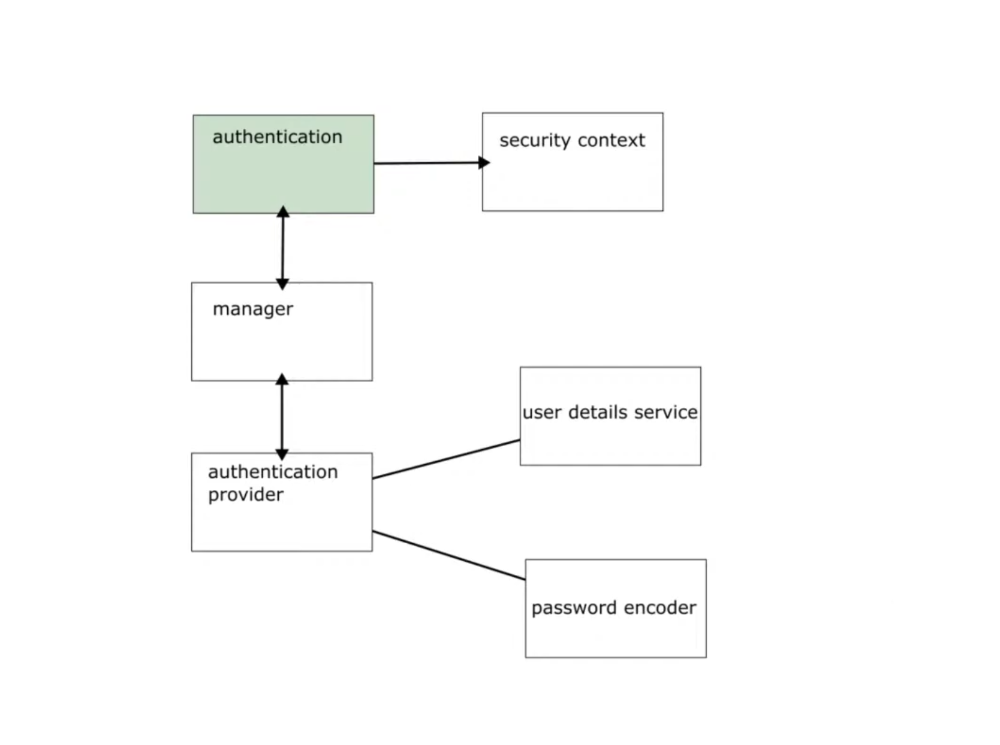
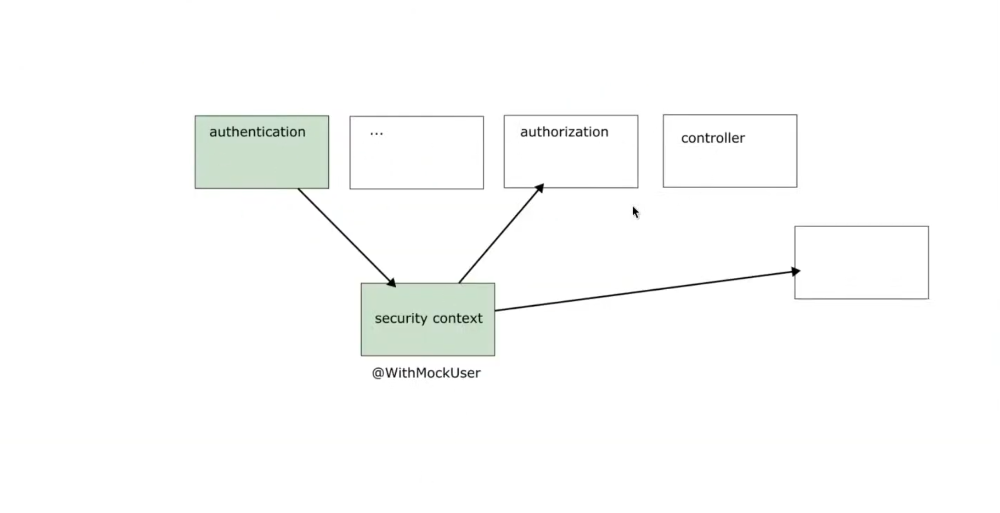

**Spring Security**

```
First and foremost,Spring security is about application level security.

Sec****urity by itself is a wide topic,for example you can implement security in the networking layer, 
docker container, JVM(PODS, Networks, Firewalls and Infra Structure)

Spring security can be used in any kind of application, because of method level security.
But working with it in web apps, we have the filter chain,

Spring security secures your application, i.e who can access certain resources in
your application (Autorization), and even more importantly, who you are,(Authentication)

Spring security also prevents common application attacks, such as CSRF,CROSS Origin Request.


```

**Spring security flow**
```
Authenitication filter -> Authentication Manager -->Authentication provider-->
( User details service + password Encoder) ---> if authenticate (true), the user is added into the spring security context)

If authentication is correct, it ends up in adding a user in the security context.
The security context,is the place where details about who has authenticated go details are stored.

The user details are used by the authorization filter,to apply the authorization rules.
The application can also use the user-details from the security context in the method as well.
The authorization happens after details have gone into the security context.
(it is after we get a user that we can be able to know their role and their permissions)

```



**Aunthentication filter**

```
The flow is as below,

(a)Authentication  filter.
(b)Authentication manager

Calls the authentication manger,to find the authentication Logic

(c)Authentication provider

(Wheew we have our authentication logic,The authenticatio provider
calls the userdetails service and the password encoder, where
user details are concerned)

(We can have more than one authentication provider)

(d)UserDetails Service
For a user to be successfully authenticated they must have been
stores before.

(e)Password encoders

passwords are stored in a hash format.

Hash function has two properties, i.e the imposibility 
of getting the input from the output,

However using a hash matches method, i can tell if 
an input can result into the saves password output,

We cannot back from output to input,but we can match
the input to the output. 

Every Password encoder has a matches() and and encode method()
encode-->hash
matches(compare rawpassword and the hash)

(f)If authentication succeed, we add a user in the security context

```

**Testing a Spring Security Application**



```
it is the authorization that is very important to test, since most of the time
we have just one authentication mechanism in applications that can be easilty tested.

However,when it comes to authorization,we need to test how all endpoints 
access  resources.

@WithMockUser during testing mocks the user authentication.
It creates a security context with only one user and that use can only be used by authorization.
When we do not have an security configuration,the only thing that matters is we have a user.
As we advante what is and who is that user will also matter and we can advance our Mock

When we need a more complex mock,we can create a custom user annotation

@WithMock user-->then  i add it specifi roles and authorities,it becomes more than enough
to write a unittest.

mockMVC is a framework used for calling endpoints, its like mockWebClient, and mockRestTemplate
mockito, is used for mocks

```

**Security Status Codes**

```
401-->Means authentication did not work.
403-->Means unauthorized.

```